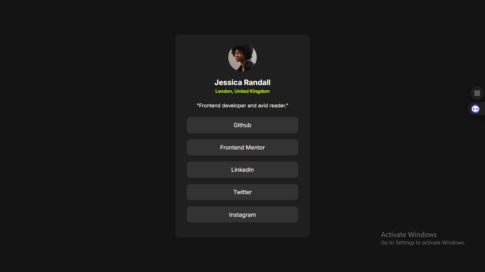

# Frontend Mentor - Social links profile solution

## Table of contents

- [Overview](#overview)
  - [The challenge](#the-challenge)
  - [Screenshot](#screenshot)
  - [Links](#links)
- [My process](#my-process)
  - [Built with](#built-with)
  - [What I learned](#what-i-learned)
  - [Continued development](#continued-development)

## Overview

A Social Links Profile

### The challenge

Users should be able to:

- See hover and focus states for all interactive elements on the page

### Screenshot

### Links

- Live Site URL: [ https://zerocpc6-droid.github.io/SOCIAL-LINKS-PROFILE/]

## My process

I started with building the HTMl structure being the card, and then centering the card, then styled the background and other coloration additions before giving it a font and smaller views style.

### Built with

- Semantic HTML5 markup
- CSS custom properties
- Flexbox
- Google Fonts
- Git and Github

### What I learned

I learnt how to use other display mode excpt flex[Flexbox] and to work with google fonts instead of importing locally.

### Continued development

Using other display modes instead of flexbox, then being able to style for smaller views or other views instead using '@fontface'.
